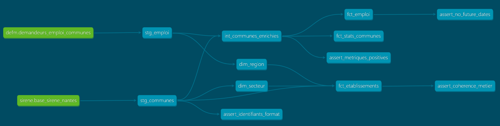

# dbt_opendata_france

Analytical pipeline built with dbt and DuckDB on French open data (SIRENE business registry + DARES employment data).
Personal learning project to practice dbt Core concepts: sources, staging, intermediate, marts, tests, and documentation.

## Data sources

| Source | Description | Coverage |
|---|---|---|
| **Base SIRENE** | Official French business registry ([data.gouv.fr](https://www.data.gouv.fr)) | ~420,000 establishments, Nantes metropolitan area |
| **DARES DEFM** | Monthly job seekers by commune ([data.gouv.fr](https://www.data.gouv.fr)) | All France, Q4 2015 → Q4 2024 |

Both CSVs are read directly by DuckDB via `read_csv_auto` - they are not loaded as dbt seeds.

## Stack

| Tool | Role |
|---|---|
| **dbt Core 1.x** | Transformations, tests, documentation |
| **dbt-duckdb** | DuckDB adapter for dbt |
| **dbt-utils** | Utility macros (`generate_surrogate_key`) |
| **DuckDB** | In-process analytical SQL engine |
| **Python + venv** | Ad hoc exploration via `main.py` |

## Pipeline architecture



```
sources (data.gouv.fr CSVs)
├── sirene/base_sirene_nantes
│   └── stg_communes              ← clean & rename, cast types, one row per establishment (SIRET)
│       ├── int_communes_enrichies ← JOIN SIRENE × DEFM, aggregate by commune, compute taux_demandeurs
│       │   ├── fct_emploi         ← incremental fact: job seekers per commune × quarter
│       │   └── fct_stats_communes ← aggregated stats per commune
│       ├── fct_etablissements     ← star schema fact: establishments per commune × NAF sector
│       └── dim_secteur            ← NAF activity sector dimension (13 business families)
└── defm/demandeurs_emploi_communes
    └── stg_emploi                ← clean & rename, split periode → annee + trimestre
        ├── int_communes_enrichies
        └── dim_region             ← French administrative regions dimension (18 regions)
```

**Star schema (marts layer)**

| Model | Type | Grain |
|---|---|---|
| `dim_region` | dimension | one row per region |
| `dim_secteur` | dimension | one row per NAF code |
| `fct_etablissements` | fact table | commune × NAF sector |
| `fct_emploi` | incremental fact | commune × quarter |
| `fct_stats_communes` | fact table | commune |

## Run the project

```bash
# Install dependencies
pip install dbt-duckdb
dbt deps          # install dbt-utils

# Run all models + tests
dbt build

# Full refresh (rebuilds incremental models from scratch)
dbt build --full-refresh

# Run only transformations
dbt run

# Run only tests
dbt test

# Preview a model result
dbt show --select stg_communes --limit 5

# Generate and browse documentation
dbt docs generate && dbt docs serve
```

## Data quality tests

**Generic tests (schema.yml)** - 65 tests across all layers
- `not_null` on all key columns
- `unique` on primary and surrogate keys
- `accepted_values` on categorical columns:
  - `etat_administratif` → `['Actif', 'Fermé']`
  - `est_employeur` → `['Oui', 'Non']`
  - `categorie_entreprise` → `['PME', 'ETI', 'GE']`
  - `sexe` → `['Total', 'Hommes', 'Femmes']`
  - `famille_metier` → 13 NAF business families
  - `categorie_tension_emploi` → `['faible', 'moyen', 'élevé', 'inconnu']`
- `relationships` (referential integrity):
  - `fct_etablissements.region_sk` → `dim_region.region_sk`
  - `fct_etablissements.secteur_sk` → `dim_secteur.secteur_sk`

**Singular tests (tests/)** - 4 custom tests
- `assert_identifiants_format.sql` - validates identifier lengths (SIRET=14, SIREN=9, NIC=5, code_commune=5)
- `assert_metriques_positives.sql` - checks metric coherence (no negatives, nb_actifs ≤ nb_etablissements)
- `assert_coherence_metier.sql` - checks nb_employeurs ≤ nb_etablissements and nb_actifs ≤ nb_etablissements in fct_etablissements
- `assert_no_future_dates.sql` - checks that no period in fct_emploi is in the future

## Project structure

```
models/
├── sources.yml
├── staging/
│   ├── schema.yml
│   ├── stg_communes.sql           ← one row per establishment (SIRET)
│   └── stg_emploi.sql             ← one row per (commune, period, sex, age group)
├── intermediate/
│   ├── schema.yml
│   └── int_communes_enrichies.sql ← JOIN SIRENE × DEFM, aggregate by commune × period
└── marts/
    ├── schema.yml
    ├── dim_region.sql             ← region dimension (surrogate key on code_region)
    ├── dim_secteur.sql            ← NAF sector dimension (surrogate key on code_naf)
    ├── fct_etablissements.sql     ← star schema fact table (TABLE)
    ├── fct_emploi.sql             ← job seekers fact table (INCREMENTAL)
    └── fct_stats_communes.sql     ← aggregated commune stats (TABLE)
macros/
└── safe_cast.sql                  ← guards SQL casts against NULL and empty strings
tests/
├── assert_identifiants_format.sql
├── assert_metriques_positives.sql
├── assert_coherence_metier.sql
└── assert_no_future_dates.sql
packages.yml                       ← dbt-utils dependency
seeds/                             ← not tracked in git
```
